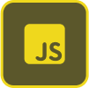
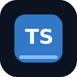
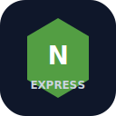
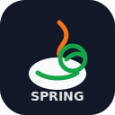
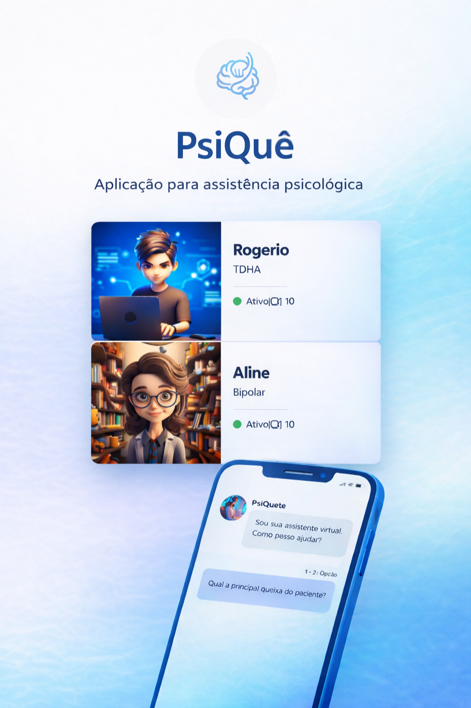
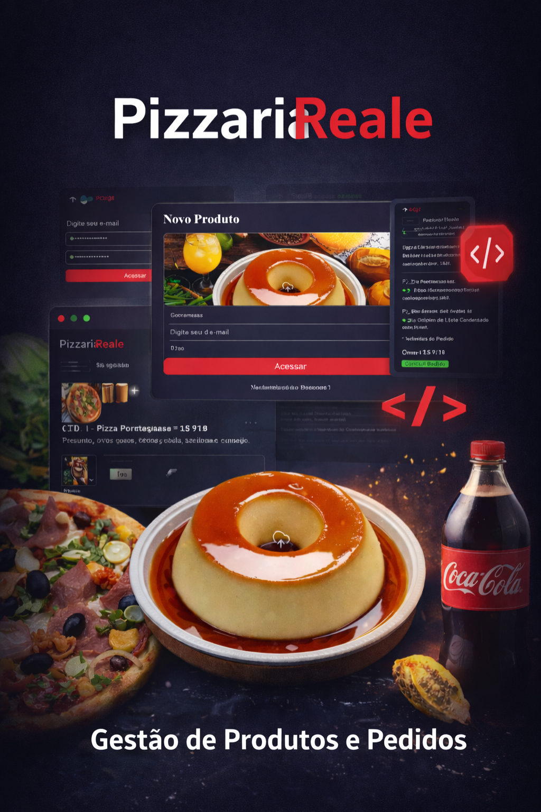
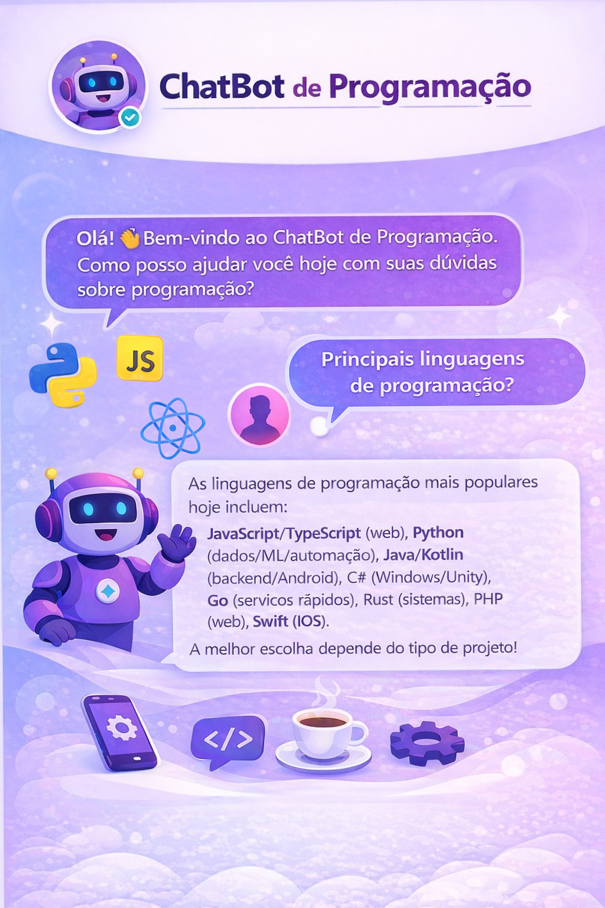
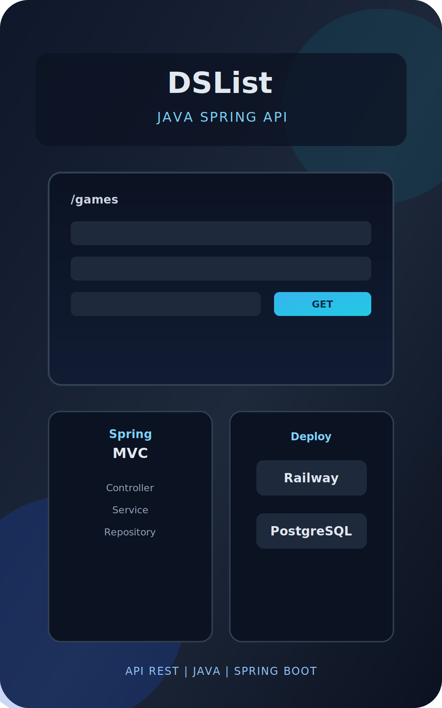
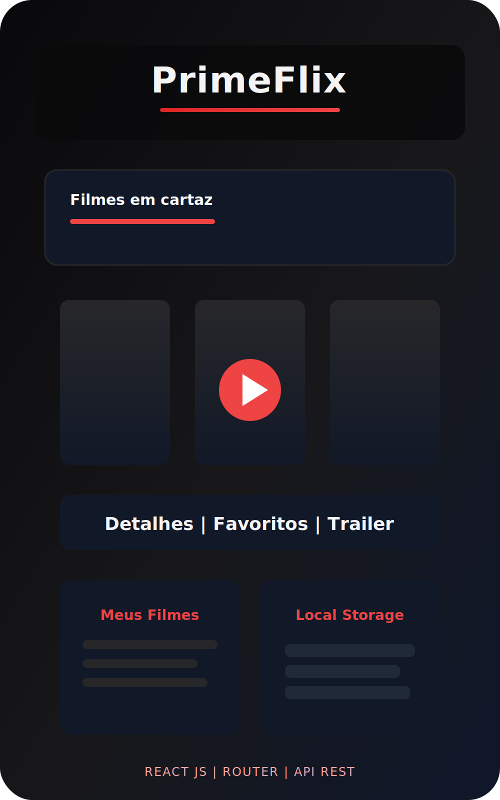

# 🚀 Portfólio | Rogério Fernandes


## 📖 Sobre o Projeto

Este repositório contém meu portfólio pessoal, desenvolvido com foco em simplicidade, organização e apresentação profissional dos projetos.

Mesmo sendo um projeto estático, ele entrega uma experiência completa:

- Navegação por âncoras com rolagem suave
- Layout responsivo para desktop e mobile
- Sessão de habilidades alinhada ao stack dos projetos
- Páginas individuais para cada projeto
- Formulário funcional com integração Formspree

## 🖼️ Preview Geral


## 🧠 Habilidades

As habilidades exibidas no portfólio foram expandidas para refletir melhor os projetos reais apresentados.

<p>
  
  
  
  
  
  
  
  
  
</p>

## 💼 Projetos

### 🧠 Psiquê



- Página local: `./projects/psique.html`
- Repositório: https://github.com/DevRogerFer/psique_core

### 🍕 Pizzaria



- Página local: `./projects/pizzaria.html`
- Repositórios:
  - https://github.com/DevRogerFer/pizzaria-backend
  - https://github.com/DevRogerFer/pizzaria-frontend
  - https://github.com/DevRogerFer/pizzaria_mobile

### 🤖 Chatbot



- Página local: `./projects/chatbot.html`
- Repositório: https://github.com/DevRogerFer/chatbot_local

### 🎮 DSList



- Página local: `./projects/dslist.html`
- Repositório: https://github.com/DevRogerFer/dslist-backend

### 🎬 PrimeFlix



- Página local: `./projects/primeflix.html`
- Repositório: https://github.com/DevRogerFer/primeflix

## 📬 Formulário de Contato

O formulário da sessão de contato foi integrado ao Formspree com envio assíncrono via JavaScript.

Funcionalidades implementadas:

- Envio via `fetch`
- Feedback visual de sucesso/erro
- Estado de carregamento no botão
- Campo honeypot anti-spam

## 🧱 Estrutura do Projeto

```bash
portfolio/
├── index.html
├── style.css
├── mobile.css
├── images/
├── projects/
└── LICENSE
```

## ⚙️ Execução Local

Como é um projeto estático, basta abrir o `index.html` no navegador.

Para melhor experiência de desenvolvimento, use uma extensão como Live Server no VS Code.

## 👨‍💻 Autor

Rogério Fernandes Siqueira

- LinkedIn: https://www.linkedin.com/in/devrogerfer
- GitHub: https://github.com/DevRogerFer

---

Se este projeto te inspirou, deixe uma estrela no repositório. ⭐
